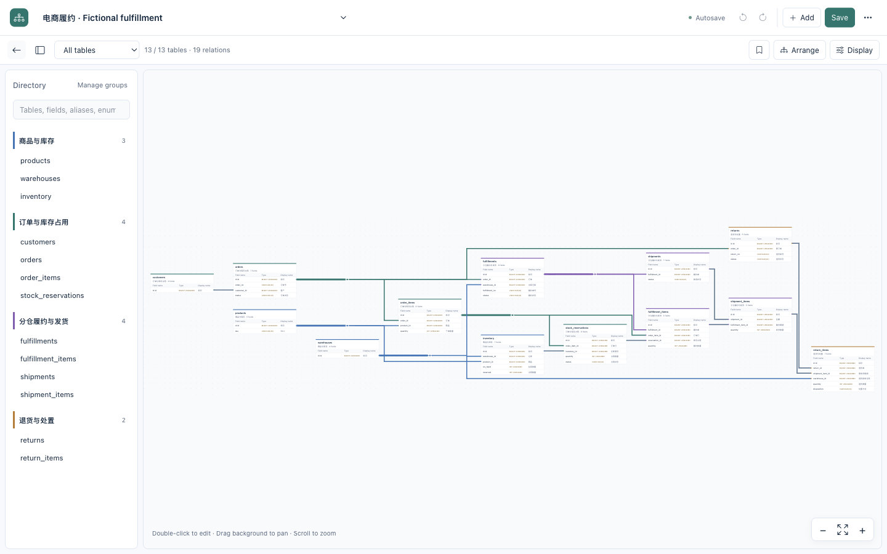
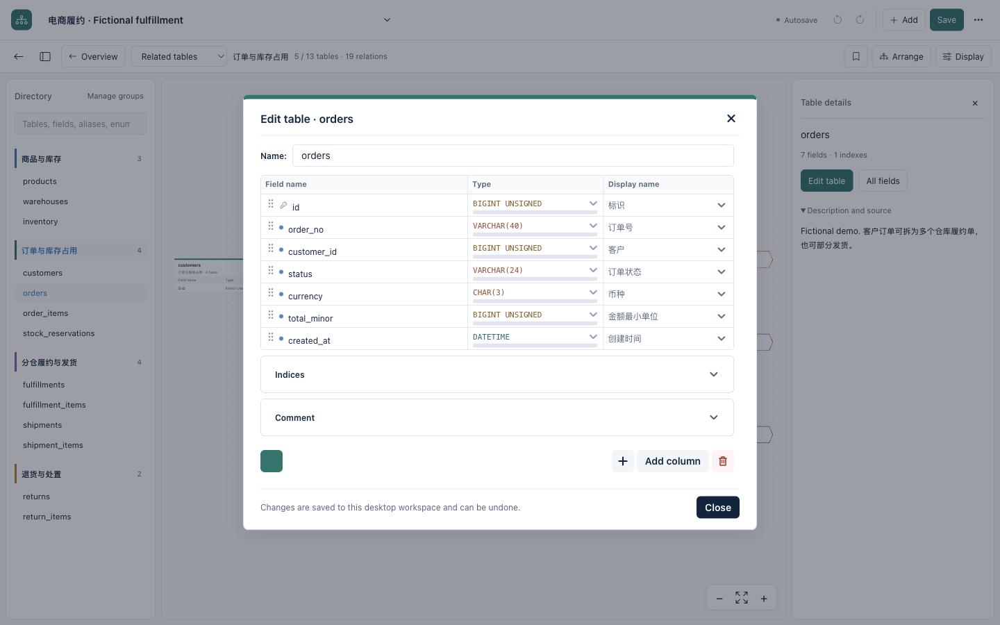

# ER Wiki

An offline-first desktop workspace for understanding and editing database models.
Built with Electron, drawDB and ELK. The desktop interface supports English,
Simplified Chinese and the system default without translating your model content.

[](https://github.com/ztcshen/er-wiki/actions/workflows/ci.yml)

**Community preview.** [Source](https://github.com/ztcshen/er-wiki) ·
[Downloads and release notes](https://github.com/ztcshen/er-wiki/releases)

[中文说明](README.zh-CN.md) · [Contributing](CONTRIBUTING.md) · [Security](SECURITY.md)

## Why this workspace

- Orthogonal ER diagrams, shared relation buses and high-fanout junctions.
- Full-model overview plus domain, table and column inspection.
- Centered table editing, annotations, enum values and explicit relation editing.
- Local JSON import/export, separate model switching, undo/redo and save controls.
- Local SQL parsing and preview before importing a new model.
- Per-model reading positions, field/alias/enum search and reading bookmarks.
- Stable geometry for text-only edits; structural edits trigger orthogonal layout.
- Versioned JSON, automatic/manual local backups and restore-as-copy.
- Pure-diagram SVG/PNG export for the viewport, domain or full model.
- Display preferences are separate from saved model content.
- No hosted account, cloud-sharing service or application telemetry is required.

## Fictional fulfillment example

The included example models **products and warehouse stock → order reservations →
split fulfillment → parcel shipment → returns**. It has 13 tables and supports
multi-warehouse allocation and partial shipments at the schema level.

These are real screenshots of the local **0.2.0-preview.1 macOS desktop app**,
loaded with the example JSON below. They are not a separately drawn mockup.



The same model in the actual table editor, including field names, types and display names:



[Model JSON](examples/fulfillment.drawdb.json) · [Example DDL](examples/fulfillment.sql)
· [Reading guide](examples/README.md) · [SVG exported by the app](docs/images/fulfillment.svg)
· [Snapshot provenance](docs/images/fulfillment-snapshot.json)

[Desktop user guide](docs/USER_GUIDE.md) · [Installation and signing](docs/DESKTOP_RELEASE.md)

Source version `0.2.0-preview.1` is a local development checkpoint until a matching
release is published. The Releases page remains the source of truth for downloads.

This is an independently authored educational schema, not an export of a company
database or Saleor's schema. [Saleor's operations overview](https://saleor.io/features/operations)
is a public reference for common stock and fulfillment concepts.

## Build locally

Requirements: Git, Node.js 22.18+ and npm. The pinned renderer source and npm
dependencies are downloaded at setup time; the installed desktop application
does not need a development server.

```sh
npm ci
npm run setup
npm run scan
npm run build
npm start
```

Create a package for the current OS/architecture:

```sh
npm run package
```

Artifacts are written under `desktop/release/<version>/`. macOS is the initial
preview target. Windows/Linux packaging paths are not release-validated.
Local macOS packages are ad-hoc signed by default. Developer ID signing and
notarization are opt-in and require the maintainer's own credentials.

The community build uses a separate **ER Wiki Community** application-data
directory. It does not read an existing private development profile.

## Project layout

- `desktop/`: Electron shell, EDA workspace and generic UI integration.
- `patches/`: modifications to pinned upstream drawDB.
- `upstream.json`: original project URL and exact renderer commit.
- `examples/`: fictional model and illustrative DDL; no row data.
- `scripts/`: setup, offline assets, demo generation and publication guard.
- `work/`: generated upstream checkout, ignored by this repository.

## Status and limits

This is a preview, not a database migration engine or a certified financial
modeling tool. Layout selection is heuristic, not a global optimum. A drawn
logical relationship is not automatically a database constraint.

See [known limitations](docs/KNOWN_LIMITATIONS.md) and the
[publication checklist](docs/PUBLISH_CHECKLIST.md). The CI badge and release page
show live status. A passing build is not an independent review or full UI acceptance.

## License and attribution

Distributed under [GNU AGPL v3](LICENSE). drawDB remains credited as the upstream
editor; this project is not affiliated with or endorsed by its maintainers.
See [NOTICE](NOTICE) for provenance and third-party components. Packaged source
includes the pinned upstream source plus the modifications and build scripts.
