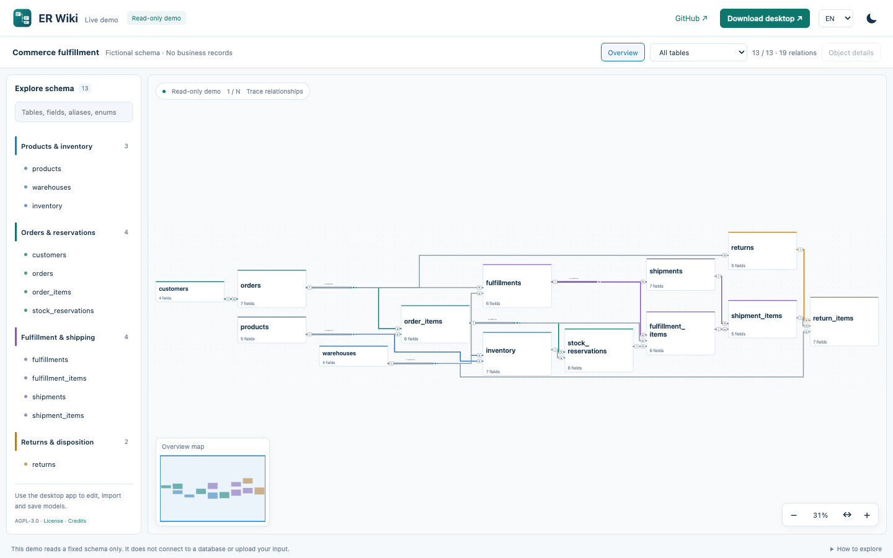
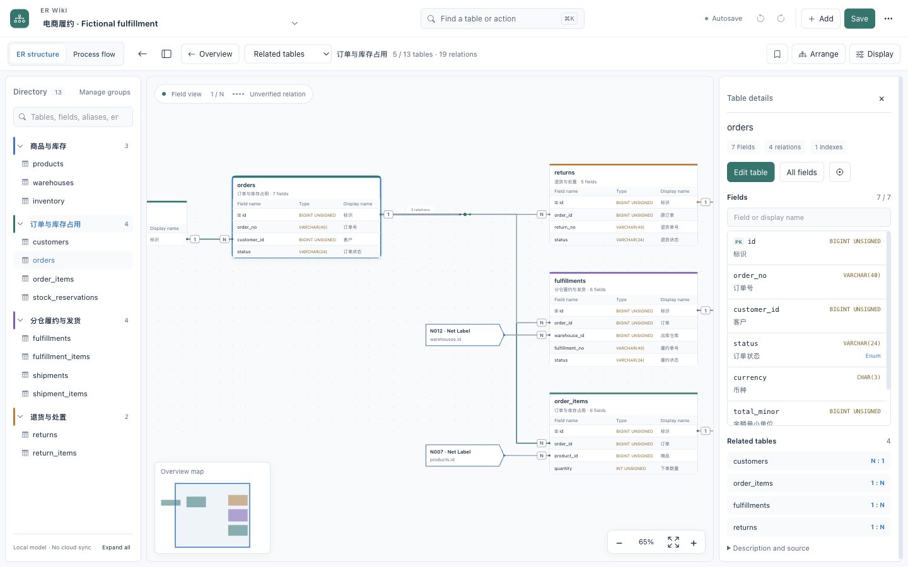
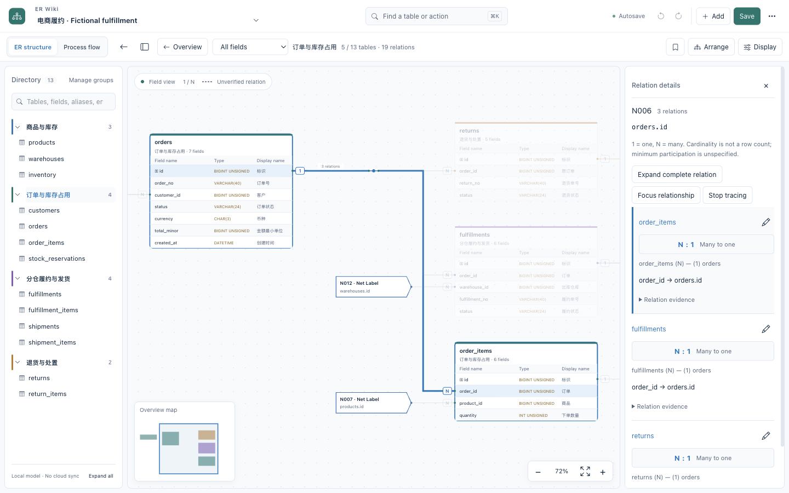
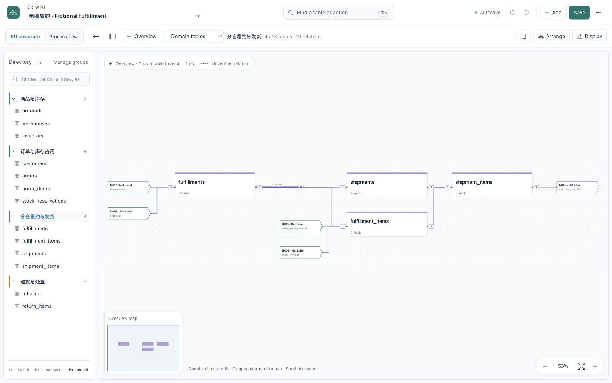
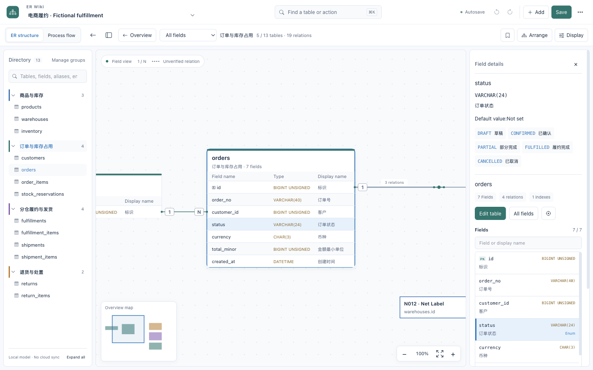
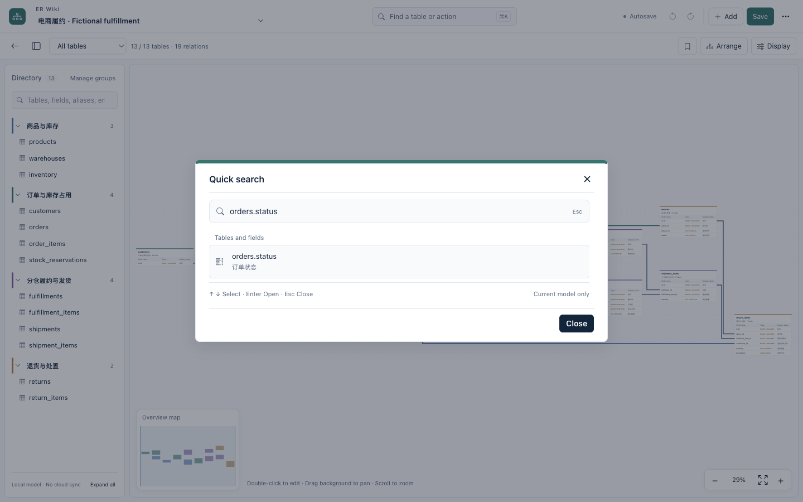

# ER Wiki

## Readable ER diagrams for complex database schemas.

**EDA-style routing for database relationships.** When a schema no longer fits on
a whiteboard, drawing every relationship is only half the problem. ER Wiki applies
orthogonal routing, obstacle avoidance and shared buses to make those connections
easier to follow.

**[Try Live Demo ↗](https://ztcshen.github.io/er-wiki/demo.html)** ·
[Project introduction](https://ztcshen.github.io/er-wiki/) ·
[Desktop download](https://github.com/ztcshen/er-wiki/releases/latest)

Offline-first desktop · AGPL-3.0 · Local SQL import · No application telemetry



13 fictional tables / 19 relationships. This is the real web renderer, not a
competitor comparison or a large-schema benchmark. Hover to trace; double-click
a wire for its fields, cardinality and recorded evidence.

[](https://github.com/ztcshen/er-wiki/actions/workflows/ci.yml)

[中文说明](README.zh-CN.md) · [Contributing](CONTRIBUTING.md) · [Security](SECURITY.md)

## Why route relationships like circuits?

Growing schemas can turn into spaghetti diagrams: shared keys, high-fanout tables
and cross-domain links compete for the same space. Database schemas and circuit
schematics share that visualization problem — many nodes, many connections,
limited 2D space. ER Wiki focuses on **how relationships are routed**, not just
where the tables sit.

- **Paths:** ELK orthogonal layouts and libavoid obstacle routing.
- **Connections:** shared relation buses, high-fanout junctions and traceable Net Labels.
- **Ports:** connections on all four sides, preserving field mappings and 1/N cardinality.
- **Navigation:** full overview → domain → table → column, with search and a minimap.

Layout is heuristic, not globally optimal. Dense graphs may still be marked
degraded. See [implementation and trade-offs](docs/WORKBENCH_DESIGN.md).

## Work on the model, locally

The Electron desktop app imports SQL locally, edits table/relationship definitions,
round-trips JSON and exports SVG/PNG. The hosted demo is read-only and uses
precomputed layouts. Neither is a database migration engine or an automatic
business-process inference tool.

The desktop works offline without a hosted account or application telemetry.
Update checks contact GitHub only when requested; the hosted site uses normal
web requests. Built on drawDB, ELK, libavoid, React and Electron; English/Chinese
interface switching does not translate model content.

The official demo is the exception: it includes complete
[English](examples/fulfillment.en.drawdb.json) and
[Chinese](examples/fulfillment.zh.drawdb.json) example configurations. They share
the same table/field IDs and relationships; only explanatory text differs.

<details>
<summary>More reading and editing capabilities</summary>

- Orthogonal ER diagrams, shared relation buses and high-fanout junctions.
- Double-click a wire for a compact explanation of its fields, cardinality and evidence; choose individual relationships on a shared bus. Try it in the live demo.
- Four-sided field ports, obstacle-avoiding routing and topology-aware SPOrE compaction; field identity and 1/N cardinality stay intact.
- Direct length/precision editing, enum editing and live structural checks without adding a review-history workflow.
- Replace a complete model in the running workspace without restarting or creating another model copy.
- Zoom-aware table summaries: readable table names in the overview, fields when zoomed in.
- Searchable field inspector with display names, types, enum values and related tables.
- Consistent domain colors for internal relationships, neutral cross-domain wires and focused relation tracing.
- Full-model overview plus domain, table and column inspection.
- Centered table editing, annotations, enum values and explicit relation editing.
- Local JSON import/export, separate model switching, undo/redo and save controls.
- Local SQL parsing and preview before importing a new model.
- Per-model reading positions, field/alias/enum search and reading bookmarks.
- Stable geometry for text-only edits; structural edits trigger orthogonal layout.
- Versioned JSON, automatic/manual local backups and restore-as-copy.
- Pure-diagram SVG/PNG export for the viewport, domain or full model.
- Display preferences are separate from saved model content.
- Keyboard-first quick search (⌘/Ctrl+K), grouped actions and independently folding domains.
- Navigation minimap, cursor-anchored zoom, 100% reading scale and remembered layout direction.
- 1 / N endpoint cardinality, individual relationship tracing and focus within bundles or Net Labels.
- No hosted account, cloud-sharing service or application telemetry is required.

</details>

## See the actual desktop

The ER diagram is the primary workspace. The directory keeps business domains
within reach; selecting a table opens its fields and related tables without
creating another copy of the model.



## Fictional fulfillment example

The included example models **products and warehouse stock → order reservations →
split fulfillment → parcel shipment → returns**. It has 13 tables and supports
multi-warehouse allocation and partial shipments at the schema level.

These are real screenshots of the **0.2.0 macOS desktop app**,
loaded with the example JSON below. They are not a separately drawn mockup.
They document that release; current source includes the newer four-sided routing
and compaction described in [workbench design](docs/WORKBENCH_DESIGN.md).
The live demo follows the deployed main branch.


Read one-to-many endpoints and trace an individual relationship inside a bundle:



<details>
<summary>Domain drilldown, field details, table editing and quick search</summary>

Inspect one business domain while retaining references to the surrounding model:



Focus on a field at reading size while keeping its context in the minimap:



The same model in the actual table editor, including field names, types and display names:


Quick search uses the same model and real desktop UI:



</details>

The same ER reading and editing tools are available in dark mode:


### Optional process context

Switch to a lightweight process view when an explicit definition is available.
Activity mappings link back to actual ER tables and fields. ER relationships do
not generate a workflow automatically. There is no mixed ER/process diagram,
BPMN designer or workflow engine. See [process-view boundaries](docs/PROCESS_VIEWS.md).

[Model JSON](examples/fulfillment.drawdb.json) · [Example DDL](examples/fulfillment.sql)
· [Reading guide](examples/README.md) · [SVG exported by the app](docs/images/fulfillment.svg)
· [Snapshot provenance](docs/images/fulfillment-snapshot.json)

[Desktop user guide](docs/USER_GUIDE.md) · [Installation and signing](docs/DESKTOP_RELEASE.md)

The [online demo](https://ztcshen.github.io/er-wiki/) reuses the desktop ER renderer,
field inspector and minimap. Explore tables, domains, enums and 1/N relations in a
browser. Editing, imports, persistence and process views remain desktop features.
See [demo scope and build instructions](site/README.md).

The Releases page is the source of truth for published versions and downloads.

This is an independently authored educational schema, not an export of a company
database or Saleor's schema. [Saleor's operations overview](https://saleor.io/features/operations)
is a public reference for common stock and fulfillment concepts.

## Build locally

Requirements: Git, Node.js 22.18+ and npm. The pinned renderer source and npm
dependencies are downloaded at setup time; the installed desktop application
does not need a development server.

```sh
npm ci
npm run setup
npm run scan
npm run build
npm start
```

Create a package for the current OS/architecture:

```sh
npm run package
```

Artifacts are written under `desktop/release/<version>/`. Published binary: **macOS Apple Silicon (ARM64)**. Windows/Linux packaging paths
are not release-validated.
Local macOS packages are ad-hoc signed by default. Developer ID signing and
notarization are opt-in and require the maintainer's own credentials.

The community build uses a separate **ER Wiki Community** application-data
directory. It does not read an existing private development profile.

## Project layout

- `desktop/`: Electron shell, EDA workspace and generic UI integration.
- `desktop/native/`: IPC, operating-system menus, command lifecycle and session policy.
- `desktop/build/`: normalized paths and the single pinned-upstream alias boundary.
- `patches/`: modifications to pinned upstream drawDB.
- `upstream.json`: original project URL and exact renderer commit.
- `examples/`: fictional model and illustrative DDL; no row data.
- `scripts/`: setup, offline assets, demo generation and publication guard.
- `work/`: generated upstream checkout, ignored by this repository.

See [workbench design and source references](docs/WORKBENCH_DESIGN.md) for the
module boundaries and UI patterns adopted from similar open-source projects.

## Status and limits

This is a local schema reading/editing tool, not a database migration engine or
a certified financial modeling tool. Layout selection is heuristic, not a global optimum. A drawn
logical relationship is not automatically a database constraint.

See [known limitations](docs/KNOWN_LIMITATIONS.md) and the
[publication checklist](docs/PUBLISH_CHECKLIST.md). The CI badge and release page
show live status. A passing build is not an independent review or full UI acceptance.

## License and attribution

Distributed under [GNU AGPL v3](LICENSE). drawDB remains credited as the upstream
editor; this project is not affiliated with or endorsed by its maintainers.
See [NOTICE](NOTICE) for provenance and third-party components. Packaged source
includes the pinned upstream source plus the modifications and build scripts.
