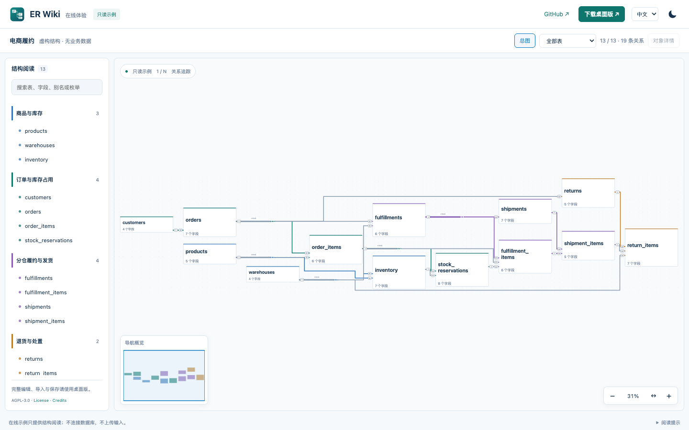

# ER Wiki

## 让复杂数据库 Schema 的 ER 图保持可读。

**把 EDA / 电路布线思想带到数据库关系图。** 当 Schema 已经画不进一块白板，
问题不只是把所有关系画出来，而是让人看得懂。ER Wiki 用正交布线、避障和共享总线
组织连接，让关系线更容易追踪。

**[打开在线 Demo ↗](https://ztcshen.github.io/er-wiki/demo.html)** ·
[产品介绍](https://ztcshen.github.io/er-wiki/zh.html) ·
[下载桌面版](https://github.com/ztcshen/er-wiki/releases/latest) · [English](README.md)

桌面离线优先 · AGPL-3.0 开源 · SQL 本机导入 · 无应用遥测



13 张虚构表、19 条关系。这是实际渲染器的截图，不是竞品对比或大型 Schema 性能证明。
打开 demo 可悬停追踪、双击查看字段映射、基数和关联依据。

官方示例提供完整[中文配置](examples/fulfillment.zh.drawdb.json)与
[英文配置](examples/fulfillment.en.drawdb.json)，切换时分组、字段说明、枚举和备注同步切换，
表字段 ID 和关系不变。用户自己的桌面模型不会被自动翻译。

源码版本见 [package.json](package.json)；已发布版本与安装包以 Releases 为准。

## 为什么借鉴 EDA 布线？

表不断增加，共享字段、高扇出核心表和跨领域关联会让 ER 图变成一团线。
数据库 Schema 与电路原理图面临相似的可视化问题：节点多、连接多，二维空间有限。
ER Wiki 不仅关注表的位置，也关注**每条关系应该怎么走**。

- 路径：ELK 正交布局与 libavoid 避障布线。
- 连接：共享总线、高扇出汇聚点和可追踪的 Net Label。
- 端口：表的四边都能连线，保留字段映射与 1/N 基数。
- 导航：总图 → 领域 → 表 → 字段，结合搜索和小地图逐层阅读。

布局是有预算限制的启发式搜索，不保证全局最优；密集图仍可能明确提示降级。
详见[实现与取舍](docs/WORKBENCH_DESIGN.md)。

## 在本机维护模型

Electron 桌面版支持本机解析 SQL、编辑表和关系、JSON 导入导出，以及 SVG/PNG 导出。
在线 demo 只读，使用预计算布局；不是数据库迁移引擎，也不自动推断业务流程。
应用无需云端账号，可离线使用；无应用遥测，不自动上传模型。只有主动检查更新时访问
GitHub，在线页面仍有正常网页请求。底层复用 drawDB、ELK、libavoid 和 React。

## 从结构总览，到表字段，再到单条关系

左侧按业务领域组织表，中间专注 ER 图，右侧就地阅读字段、枚举和关联关系。
阅读位置与模型内容分开保存，不会因为移动视角而修改模型。


## 桌面工作流

<details>
<summary>展开更多阅读和编辑能力</summary>

- 双击连线弹出关系说明：关联字段、1/N 含义、条件和业务依据；共享总线可选择单条关系。在线 demo 同步支持。

- 四边字段端口、正交避障布线和 SPOrE 空白压缩，保留字段绑定、1/N 基数与相对位置约束。
- 直接编辑字段长度和精度、配置枚举、实时检查结构；不引入评审留痕或版本基线流程。
- 运行中整体替换当前模型，无需重启应用，也不创建重复模型。
- 缩放分级显示：远看表名和结构，近看字段；总图始终保留全部表。
- 表详情支持筛选字段、中文显示名、类型、枚举及关联表入口。
- 组内关系使用领域色，跨领域连线保持中性色；选中关系突出两端表与对应路径。
- 统一设置：语言、主题、自动保存、备份保留数量与手动检查更新。
- ⌘/Ctrl+K 快速查找表、字段和操作；菜单按任务分组，目录分组可独立折叠。
- 按模型恢复领域、选中表、缩放平移；支持阅读书签和返回上次位置。
- 导航小地图、鼠标定点缩放、100% 阅读比例，以及自动／横向／纵向布局方向。
- 表端 1 / N 基数、线束内单条关系追踪，以及包含 Net Label 的完整关系定位。
- 搜索表、字段、别名、注释及枚举解释。
- 修改显示名称、说明和枚举不重排整图；结构变化重新布局。
- SQL 本机解析预览后导入新模型；JSON 带版本号并兼容旧文件。
- 自动或手动本地备份，恢复为副本；SVG / PNG 导出当前视图、领域或完整总图。

</details>

详见[使用说明](docs/USER_GUIDE.md)和[安装、签名与公证说明](docs/DESKTOP_RELEASE.md)。
也可以[直接打开在线案例](https://ztcshen.github.io/er-wiki/)，体验缩放、分组、表字段搜索、枚举和关系追踪。
在线版复用桌面 ER 组件，只提供阅读，不开放编辑、导入、保存或流程图。[实现与范围](site/README.md)。
界面参考与模块划分见[工作台设计说明](docs/WORKBENCH_DESIGN.md)。

## 电商履约示例

示例独立虚构，不来自真实业务数据库。13 张表覆盖：

- 商品、仓库及库存；
- 订单明细与库存占用；
- 分仓履约、包裹及部分发货；
- 退货申请、退货明细与入库处置。

以下为本地 **0.2.0 macOS 桌面应用的真实截图**，加载的就是下方示例 JSON，
不是另一套绘图脚本生成的示意图。
截图记录该发布版本；当前源码已加入四边连线及空白压缩，详见[工作台设计说明](docs/WORKBENCH_DESIGN.md)。在线示例以已部署的 main 分支为准。


查看表两端的一对多基数，在线束中单独追踪一条关系：


<details>
<summary>领域阅读、字段详情、表编辑和快速查找截图</summary>

进入单个领域阅读，边界关系仍可追踪：


定位到字段，以正常比例阅读，并通过小地图保留位置参照：


同一模型的真实表编辑界面，展示字段名、类型、显示名称三列：


同一模型的快速查找，可直接定位到表和字段：


</details>

深色模式保留相同的 ER 阅读和编辑能力：


### 流程图只是辅助

有显式配置时，可以切换到简单流程视图，通过动作关联对应表和字段。
不会从外键自动推演业务时序，不提供混合图、BPMN 设计器或流程执行引擎。
详见[流程视图边界](docs/PROCESS_VIEWS.md)。

可直接查看 [DDL](examples/fulfillment.sql)、
[模型 JSON](examples/fulfillment.drawdb.json)、[阅读说明](examples/README.md)、
[程序导出的 SVG](docs/images/fulfillment.svg) 和[快照来源记录](docs/images/fulfillment-snapshot.json)。
不包含客户、地址、订单等实际业务记录。

## 本机构建

```sh
npm ci
npm run setup
npm run scan
npm run build
npm start
```

需要 Git、Node.js 22.18+。使用 `npm run package` 打包当前平台，
安装包放在 `desktop/release/`。本次提供 **macOS Apple Silicon（ARM64）** 安装包，
Windows/Linux 尚未发布验证。默认包使用临时签名；Developer ID 签名、公证入口
已提供，需要维护者自己的证书与凭据才能执行。

代码许可证沿用上游的 [AGPL-3.0](LICENSE)，来源与第三方组件见
[NOTICE](NOTICE)。发布前还需完成[发布清单](docs/PUBLISH_CHECKLIST.md)；
仅构建成功不代表所有交互已经验收。
