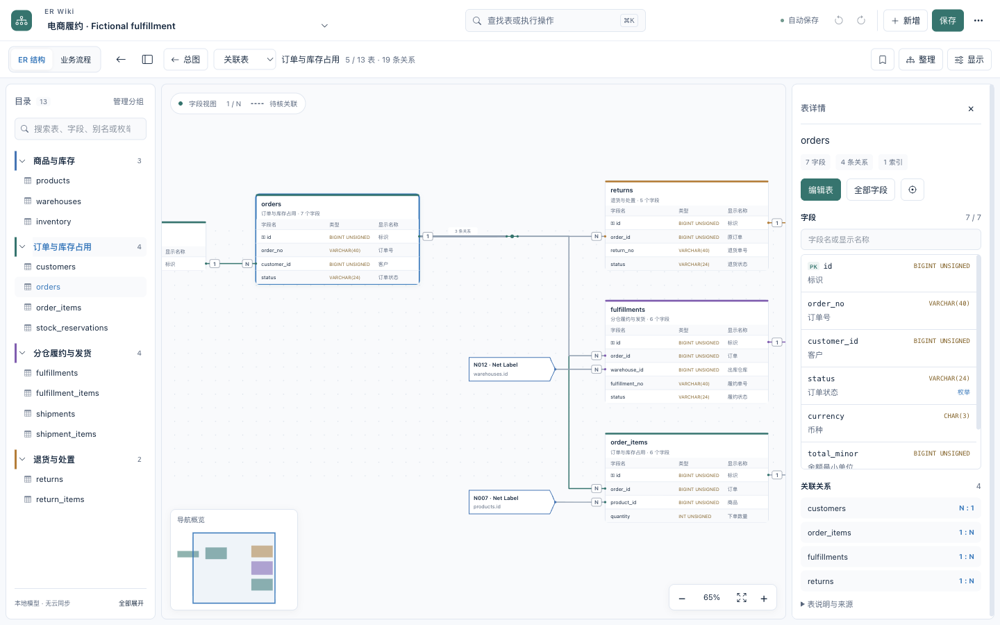
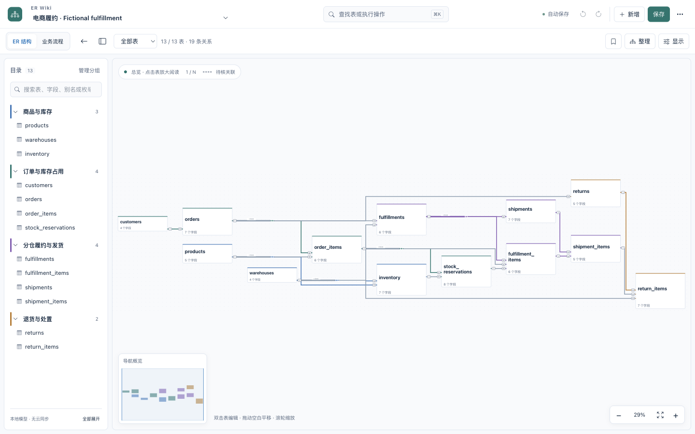
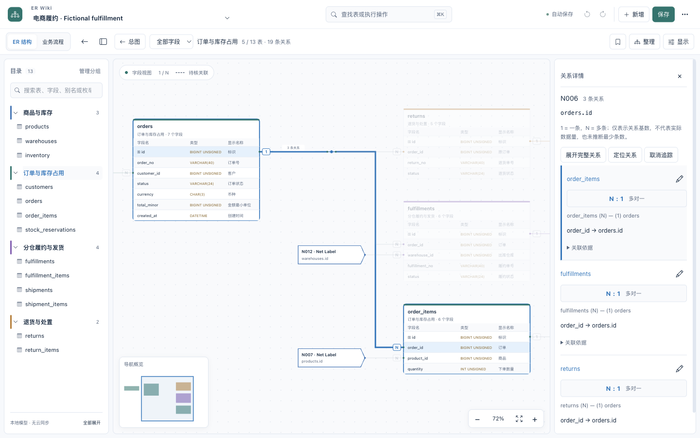
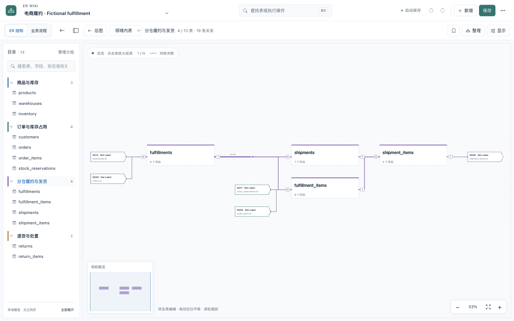
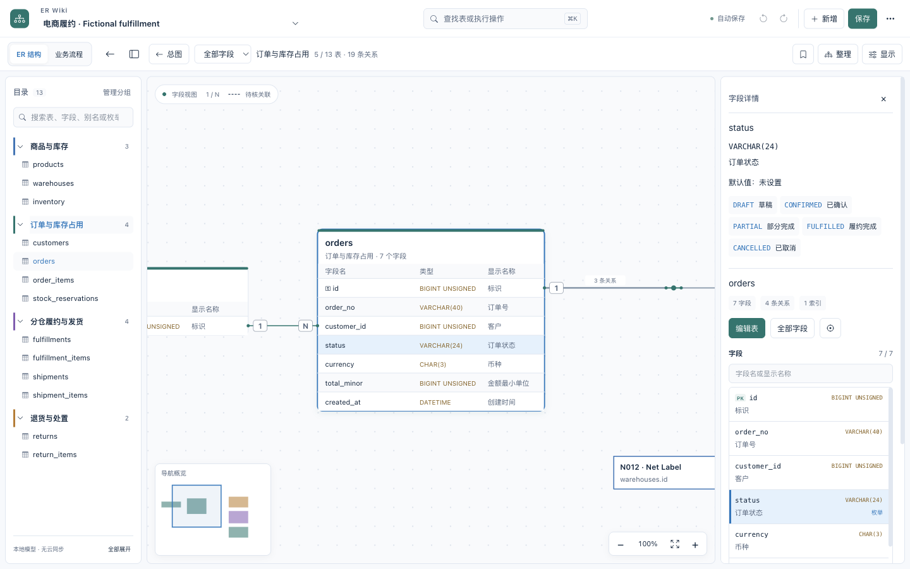
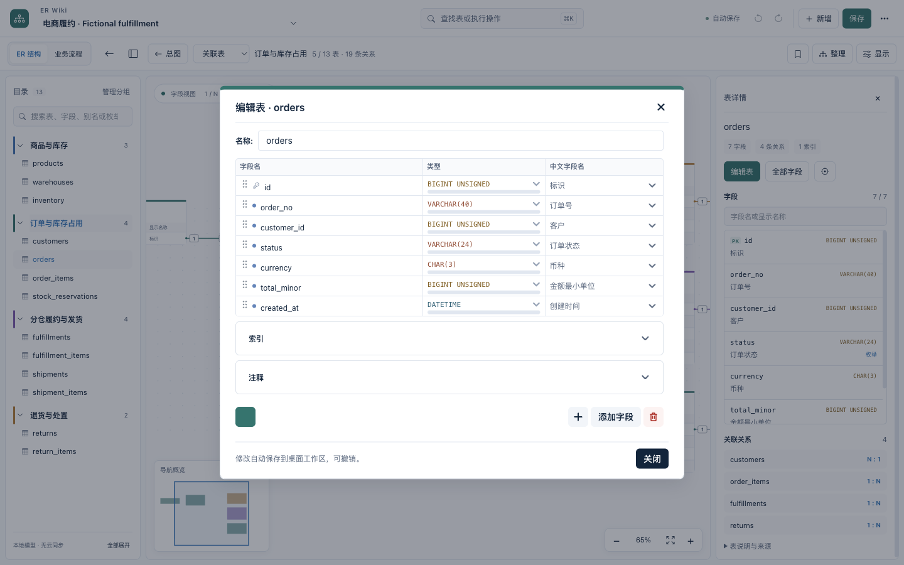
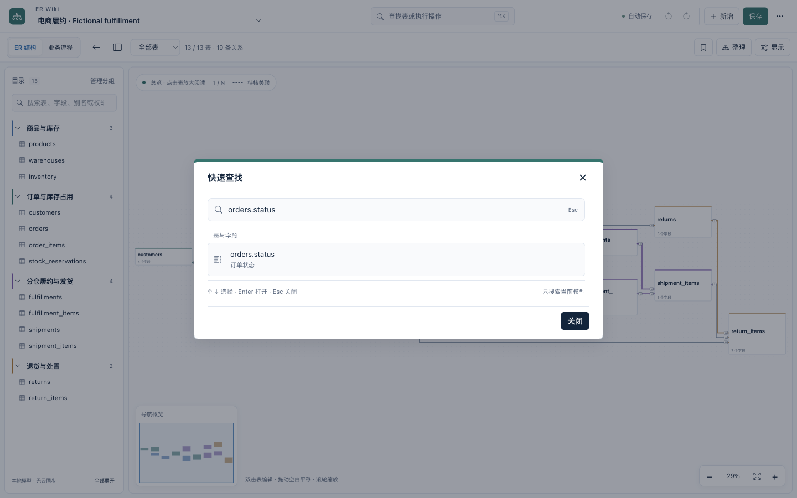
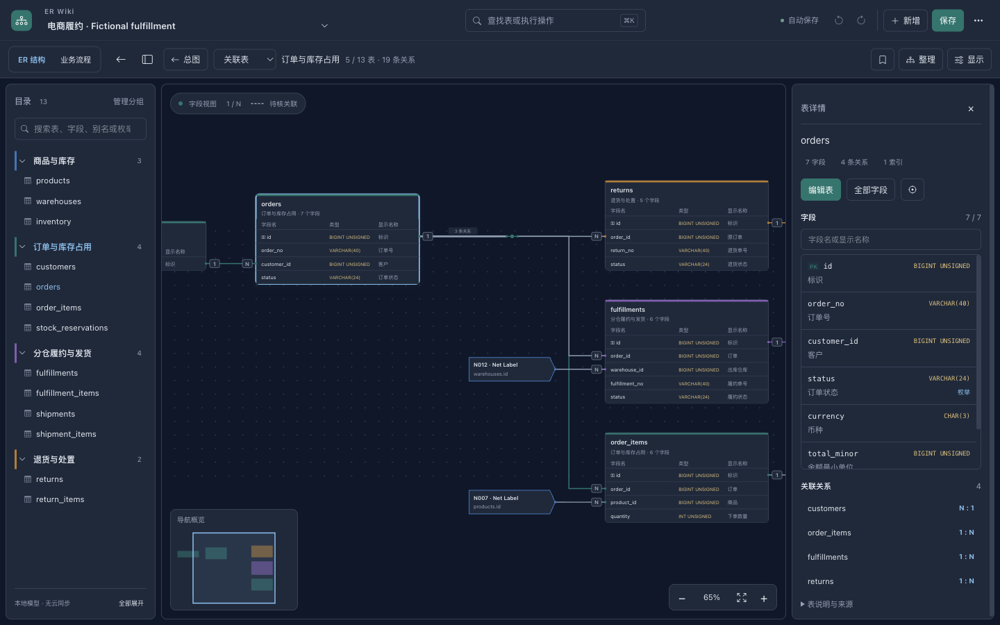

# ER Wiki

一个本地优先的数据库模型桌面工作台，基于 Electron、drawDB 和 ELK。
支持简体中文、English 和跟随系统，切换语言不会改写模型内容。
社区版与原有业务工作区使用不同的数据目录。

**以 ER 图为核心的桌面模型工作台。**
[GitHub 仓库](https://github.com/ztcshen/er-wiki) ·
[下载与发布说明](https://github.com/ztcshen/er-wiki/releases) ·
[CI 状态](https://github.com/ztcshen/er-wiki/actions/workflows/ci.yml)

当前源码版本为 `0.2.0`；已发布版本与安装包以 Releases 为准。

## 从结构总览，到表字段，再到单条关系

左侧按业务领域组织表，中间专注 ER 图，右侧就地阅读字段、枚举和关联关系。
阅读位置与模型内容分开保存，不会因为移动视角而修改模型。



## 桌面工作流

- 缩放分级显示：远看表名和结构，近看字段；总图始终保留全部表。
- 表详情支持筛选字段、中文显示名、类型、枚举及关联表入口。
- 组内关系使用领域色，跨领域连线保持中性色；选中关系突出两端表与对应路径。
- 统一设置：语言、主题、自动保存、备份保留数量与手动检查更新。
- ⌘/Ctrl+K 快速查找表、字段和操作；菜单按任务分组，目录分组可独立折叠。
- 按模型恢复领域、选中表、缩放平移；支持阅读书签和返回上次位置。
- 导航小地图、鼠标定点缩放、100% 阅读比例，以及自动／横向／纵向布局方向。
- 表端 1 / N 基数、线束内单条关系追踪，以及包含 Net Label 的完整关系定位。
- 搜索表、字段、别名、注释及枚举解释。
- 修改显示名称、说明和枚举不重排整图；结构变化重新布局。
- SQL 本机解析预览后导入新模型；JSON 带版本号并兼容旧文件。
- 自动或手动本地备份，恢复为副本；SVG / PNG 导出当前视图、领域或完整总图。

详见[使用说明](docs/USER_GUIDE.md)和[安装、签名与公证说明](docs/DESKTOP_RELEASE.md)。
界面参考与模块划分见[工作台设计说明](docs/WORKBENCH_DESIGN.md)。

## 电商履约示例

示例独立虚构，不来自真实业务数据库。13 张表覆盖：

- 商品、仓库及库存；
- 订单明细与库存占用；
- 分仓履约、包裹及部分发货；
- 退货申请、退货明细与入库处置。

以下为本地 **0.2.0 macOS 桌面应用的真实截图**，加载的就是下方示例 JSON，
不是另一套绘图脚本生成的示意图。



查看表两端的一对多基数，在线束中单独追踪一条关系：



<details>
<summary>领域阅读、字段详情、表编辑和快速查找截图</summary>

进入单个领域阅读，边界关系仍可追踪：



定位到字段，以正常比例阅读，并通过小地图保留位置参照：



同一模型的真实表编辑界面，展示字段名、类型、显示名称三列：



同一模型的快速查找，可直接定位到表和字段：



</details>

深色模式保留相同的 ER 阅读和编辑能力：



### 流程图只是辅助

有显式配置时，可以切换到简单流程视图，通过动作关联对应表和字段。
不会从外键自动推演业务时序，不提供混合图、BPMN 设计器或流程执行引擎。
详见[流程视图边界](docs/PROCESS_VIEWS.md)。

可直接查看 [DDL](examples/fulfillment.sql)、
[模型 JSON](examples/fulfillment.drawdb.json)、[阅读说明](examples/README.md)、
[程序导出的 SVG](docs/images/fulfillment.svg) 和[快照来源记录](docs/images/fulfillment-snapshot.json)。
不包含客户、地址、订单等实际业务记录。

## 本机构建

```sh
npm ci
npm run setup
npm run scan
npm run build
npm start
```

需要 Git、Node.js 22.18+。使用 `npm run package` 打包当前平台，
安装包放在 `desktop/release/`。本次提供 **macOS Apple Silicon（ARM64）** 安装包，
Windows/Linux 尚未发布验证。默认包使用临时签名；Developer ID 签名、公证入口
已提供，需要维护者自己的证书与凭据才能执行。

代码许可证沿用上游的 [AGPL-3.0](LICENSE)，来源与第三方组件见
[NOTICE](NOTICE)。发布前还需完成[发布清单](docs/PUBLISH_CHECKLIST.md)；
仅构建成功不代表所有交互已经验收。
